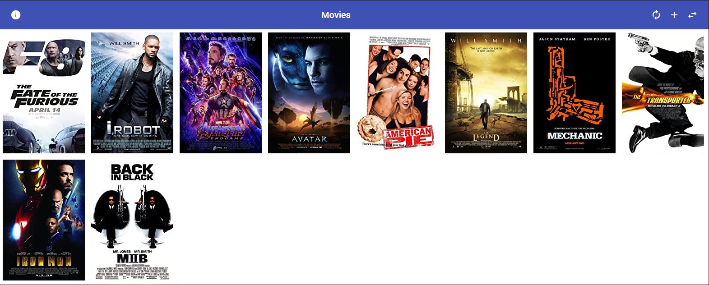
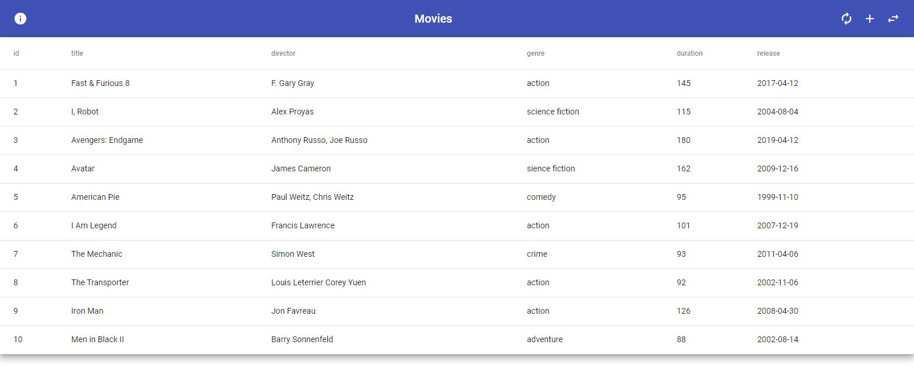

# Simple CRUD UI

* [About](#About)
   * [Screenshots](#Screenshots)
* [Getting Started](#Getting-Started)
    * [Prerequisites](#Prerequisites)
    * [Installation](#Installation)
* [Usage](#Usage)
* [To Do](#To-Do)

## About
A simple CRUD UI made with Angular 11

### Screenshots
Basic view

Advanced view


## Getting Started
To get a local copy up and running follow these simple example steps.

### Prerequisites
* npm
* Angular & Angular CLI

### Installation
0. Follow instructions from [simple-crud-api](https://github.com/NickDeWyngaert/simple-crud-api) repository to install & run the API
1. Clone the repository
   ```sh
   git clone https://github.com/NickDeWyngaert/simple-crud-ui.git
   ```
2. Change directory
   ```sh
   cd simple-crud-ui
   ```
3. Install dependencies
   ```sh
   npm install
   ```
4. Run (Default endpoint is [localhost:4200](http://localhost:4200))
   ```sh
   ng serve -o
   ```

## Usage
* This applications contains the user interface for an existing API
* This UI needs the API to work perfectly
* The API is located at [simple-crud-api](https://github.com/NickDeWyngaert/simple-crud-api)

## To Do
* General
   - [ ] More info when form field in new movie isn't good enough
* Basic view
   - [ ] Dynamic width and height for each movie item (movie img)
* Advanced view
   - [ ] Better datatable (with search, filtering, sorting, ...)
   - [ ] More UI friendly expanded movie detail
   - [ ] Edit/Update movie